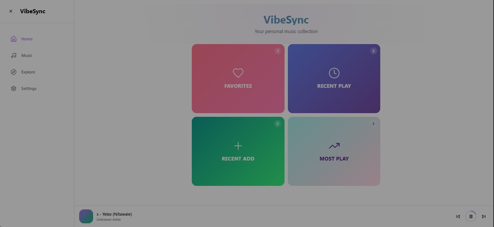
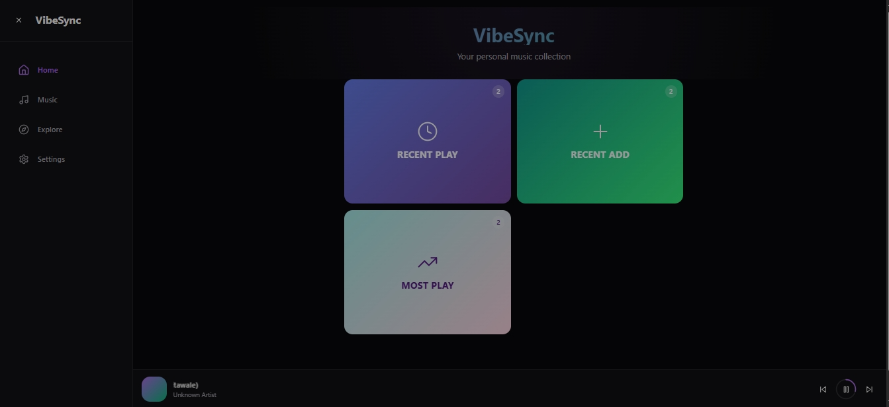
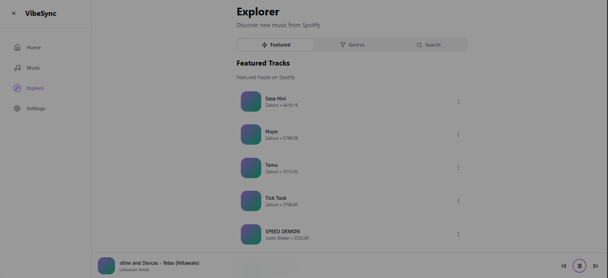
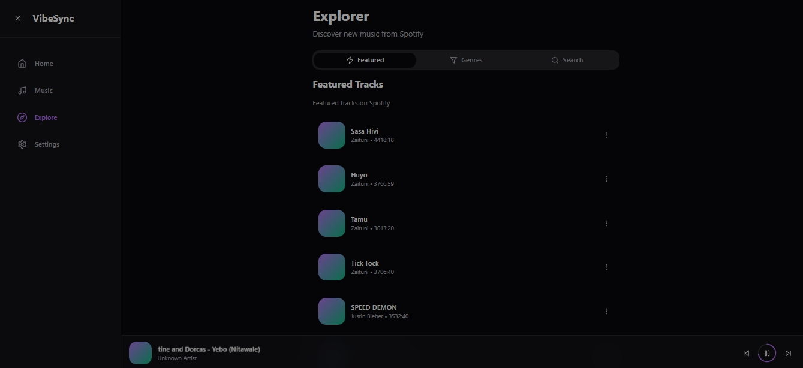
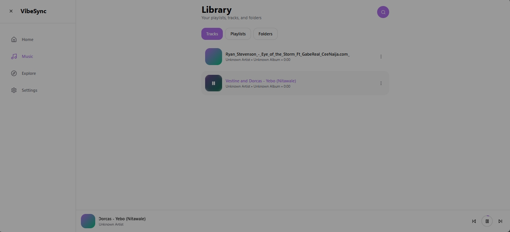
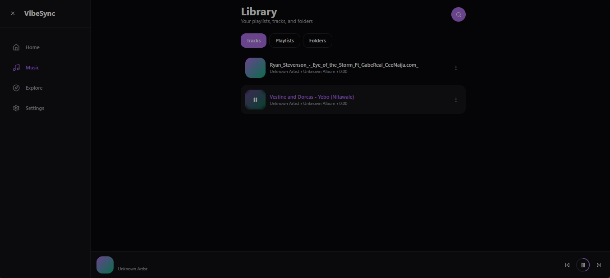
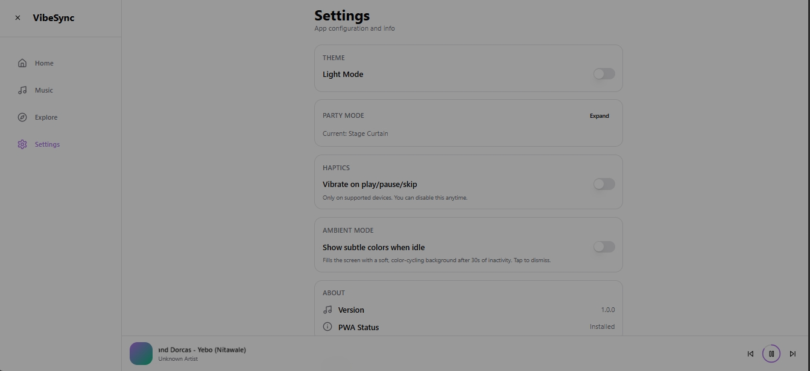
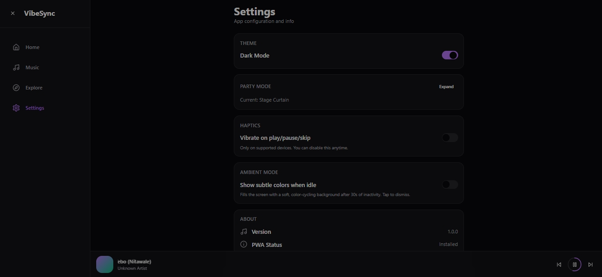
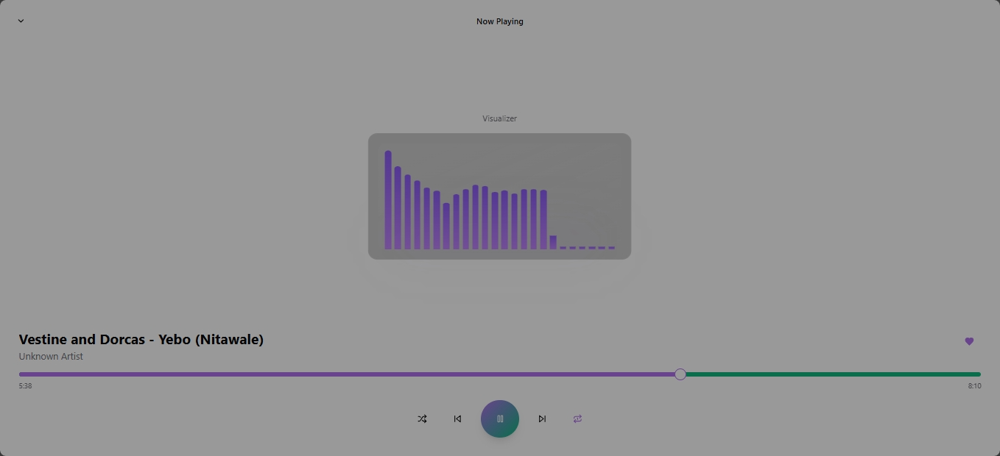
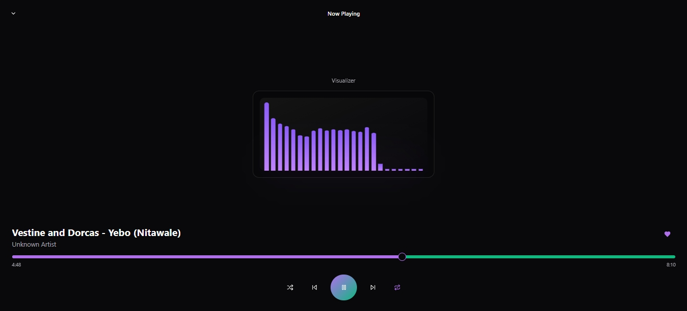

## VibeSync — Music Player

[](#) [](#) [](https://github.com/GitMaster254/vibesync/issues)

VibeSync is an offline-first, PWA music player built with Vite, React and TypeScript. It focuses on fast local library management, seamless playback, and a beautiful, responsive UI. The app supports importing local audio files, extracting metadata (worker fallback + optional server backend), playlists, searching, and a lightweight streaming proxy for remote audio.

Key features
------------
- Offline-first PWA music player with local library support
- Party Mode
- Import and metadata extraction (worker fallback; optional server backend for rich extraction)
- Playlist management, favorites, recently played, and more
- Lightweight serverless stream proxy at `api/spotify/stream.ts` for CORS-friendly streaming
- Built with Vite, React, TypeScript, Tailwind CSS and shadcn/ui components
- Classic support for both Desktop and Mobile users

Table of contents
-----------------
- [Demo](#demo)
- [Quickstart](#quickstart)
- [Installation](#installation)
- [Usage](#usage)
- [Configuration](#configuration)
- [Development](#development)
- [Screenshoots](#screenshots--assets)
<!-- - [Testing](#testing) -->
- [Contributing](#contributing)
- [Security](#security)
- [License](#license)

Demo
----
Add a short GIF or a link to a deployed demo here. To include images/screenshots, add PNGs to the repository (recommended path: `docs/images/`) or reference the app icons in `public/icons/` (for example `/icons/icon-192x192.png`).

Quickstart
----------
Get the dev server running locally (Windows / cmd.exe):

```cmd
npm install
npm run dev
```

The dev server runs on port 8080 by default (see `vite.config.ts`). Open http://localhost:8080/ in your browser.

Installation
------------
This project is an application (not intended for npm publishing). To run locally:

```cmd
npm install
npm run dev        # start development server
npm run build      # build production assets
npm run preview    # preview the production build
```

Usage
-----
- Open the app in your browser and use the Library → Upload files button to import audio.
- The app will use a worker fallback for basic metadata extraction. If you deploy the serverless backend, it will perform richer extraction (FFmpeg, cover art).
- Serverless stream proxy: `api/spotify/stream.ts` forwards Range requests and adds CORS headers (useful for remote audio sources).

Configuration
-------------
- Environment variables: frontend reads `VITE_METADATA_API` (optional) to point to a metadata extraction API.
- Path aliases: `@` → `./src` (configured in `tsconfig.json`).

Development
-----------
Key scripts (run with npm):

```cmd
npm run dev       # start Vite dev server (port 8080)
npm run build     # production build
npm run build:dev  # build with development mode
npm run lint       # run ESLint
npm run preview    # preview the production build
```

Notes for contributors:
- The UI is located under `src/components` and `src/pages`.
- Serverless API routes live in the `api/` directory (Vercel-style functions). See `api/spotify/stream.ts` for the streaming proxy.
- Tailwind config: `tailwind.config.ts`.

Screenshots / Assets
--------------------
Below are the app screenshots for both light and dark themes. File names indicate the theme (Light / Dark) and the app section shown (Home, Explore, Music, Settings).

| Section | Light | Dark |
|---|---:|---:|
| Home |  |  |
| Explore |  |  |
| Music / Player |  |  |
| Settings |  |  |
| Visualizer |  |  |

Notes and recommended sizes

- Place additional screenshots in `docs/images/` and name them with the `Light`/`Dark` prefix and a short section name (for example `LightNowPlaying.png`).
- Use `/icons/icon-192x192.png` for small thumbnails and `/icons/icon-512x512.png` for larger assets (in `public/icons/`).
- If images render too large on GitHub, consider creating smaller thumbnails (e.g., 800px width) and referencing those instead.

Contributing
------------
Contributions are welcome. Please read `CODE_OF_CONDUCT.md` and `SECURITY.md` before opening issues or PRs. See `TODO.md` for planned work and feature ideas.

Security
--------
If you find a security issue, follow the private reporting steps in [SECURITY](SECURITY).

License
-------
This project is licensed under the MIT License — see the [LICENSE](LICENSE) file for details.


---

<!-- Roadmap
-------
High-level planned features and milestones. Use an ordered list and dates where possible. Mark what’s planned, in-progress, and done. -->

FAQ / Troubleshooting
---------------------
Common problems and solutions (installation errors, runtime errors, configuration pitfalls).


Maintainers
-----------
- Repo owner:

	-  GitMaster254 (https://github.com/GitMaster254)

- Collaborators:

	- Achacha Hedmon  (https://github.com/Hedmon0094)

	- Amos Kilonzo		  (https://github.com/Amos0101)

	- Linda Nekesa	  (https://github.com/LindaNekesa)
	

Acknowledgements
----------------
Credits, libraries, and resources used.


Contact / Support
-----------------
For support or questions, open an issue using the appropriate issue template, or contact the maintainers.